# Awaaj — Safe & Anonymous Domestic Abuse Reporting Platform

<div align="center">

**Awaaj** (meaning "voice") is a full-stack platform that gives domestic abuse victims a safe, anonymous way to report their situation. Users fill out a simple form, an AI generates a detailed report, and the report is secretly hidden inside an ordinary-looking image using **steganography**. The image is saved securely, and only authorized admins can extract and read the hidden information. After submission, users can optionally find nearby NGOs, police stations, hospitals, and shelters using their location — in case they need immediate in-person help.

[](LICENSE)
[](https://nextjs.org/)
[](https://fastapi.tiangolo.com/)
[](https://www.mongodb.com/)

</div>

---

## Demo

<div align="center">

<video src="assets/demo.mp4" controls width="700"></video>

</div>

---

## Screenshots

<table>
  <tr>
    <td align="center"><b>Homepage</b><br/></td>
    <td align="center"><b>Homepage</b><br/>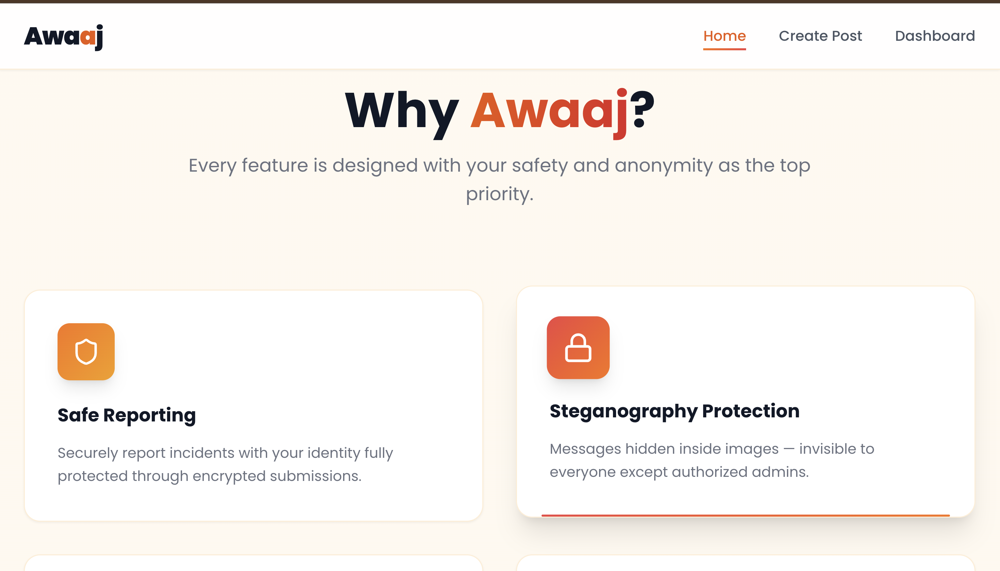</td>
  </tr>
  <tr>
    <td align="center"><b>Homepage</b><br/>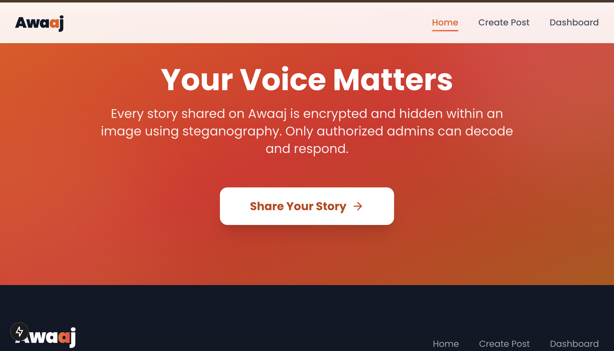</td>
    <td align="center"><b>FAQ</b><br/>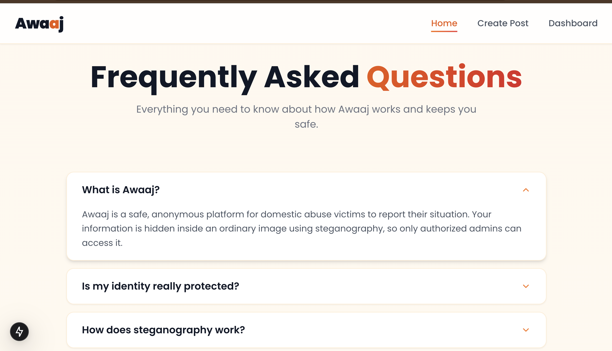</td>
  </tr>
  <tr>
    <td align="center"><b>Create Post</b><br/>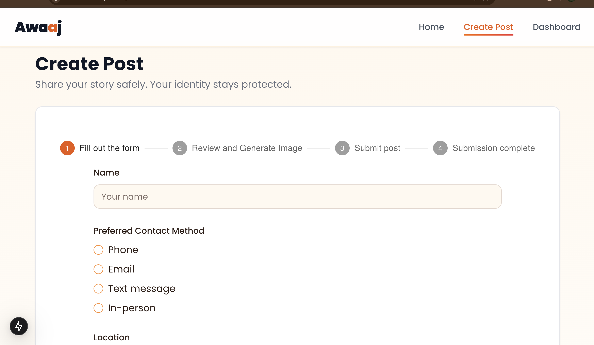</td>
    <td align="center"><b>Form Demo</b><br/>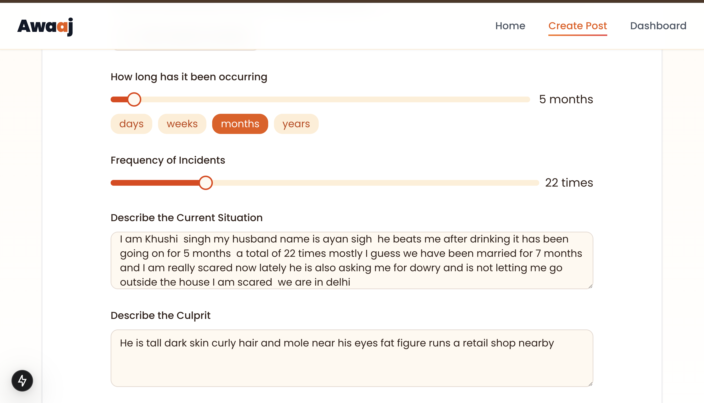</td>
  </tr>
  <tr>
    <td align="center"><b>AI-Generated Report (1)</b><br/>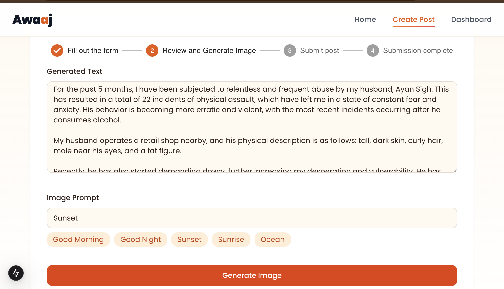</td>
    <td align="center"><b>AI-Generated Report (2)</b><br/>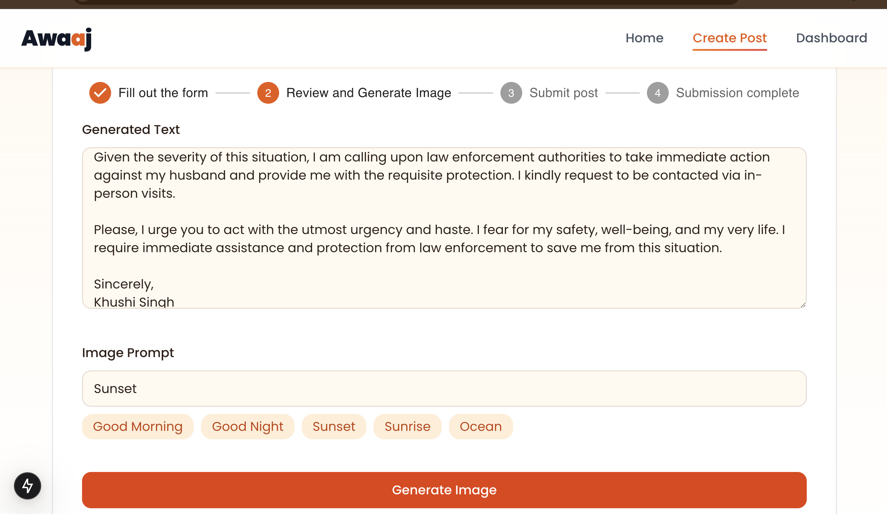</td>
  </tr>
  <tr>
    <td align="center"><b>Image Generated</b><br/>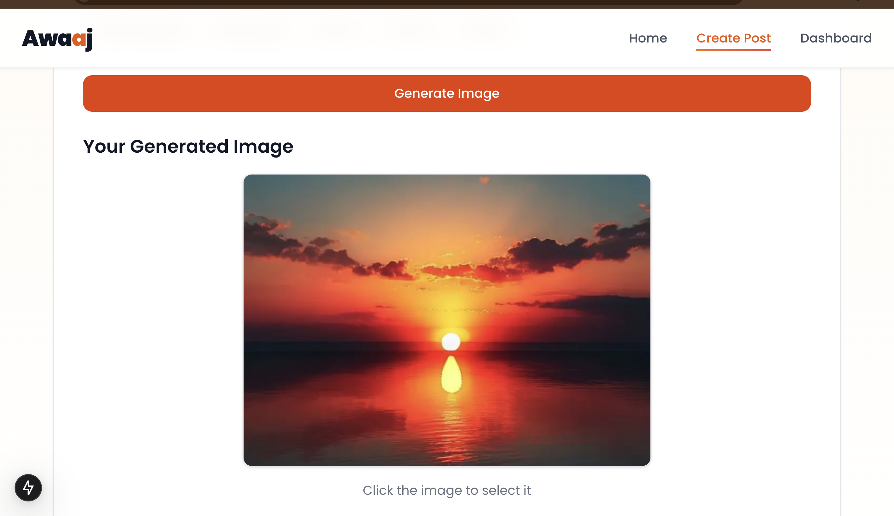</td>
    <td align="center"><b>Encoded Image</b><br/>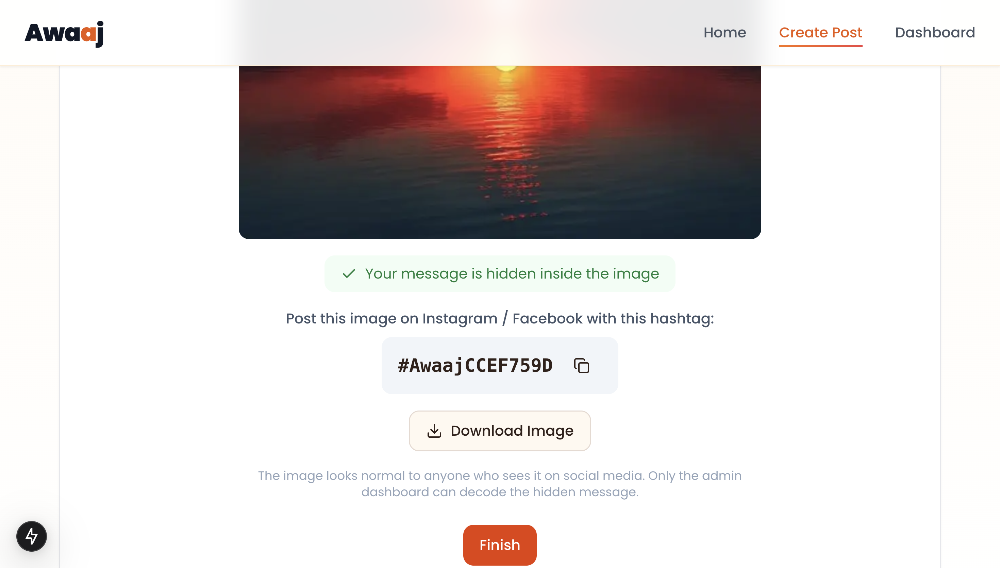</td>
  </tr>
  <tr>
    <td align="center"><b>Confirmation</b><br/>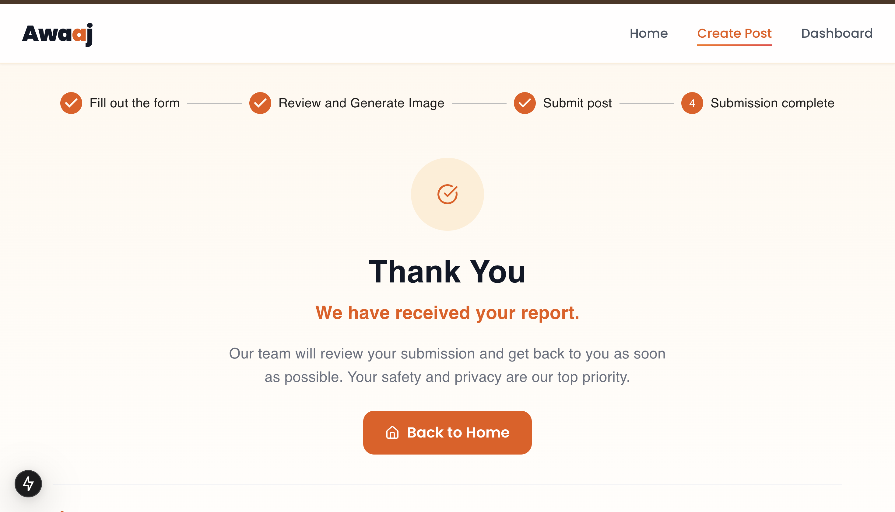</td>
    <td align="center"><b>Nearby Places</b><br/>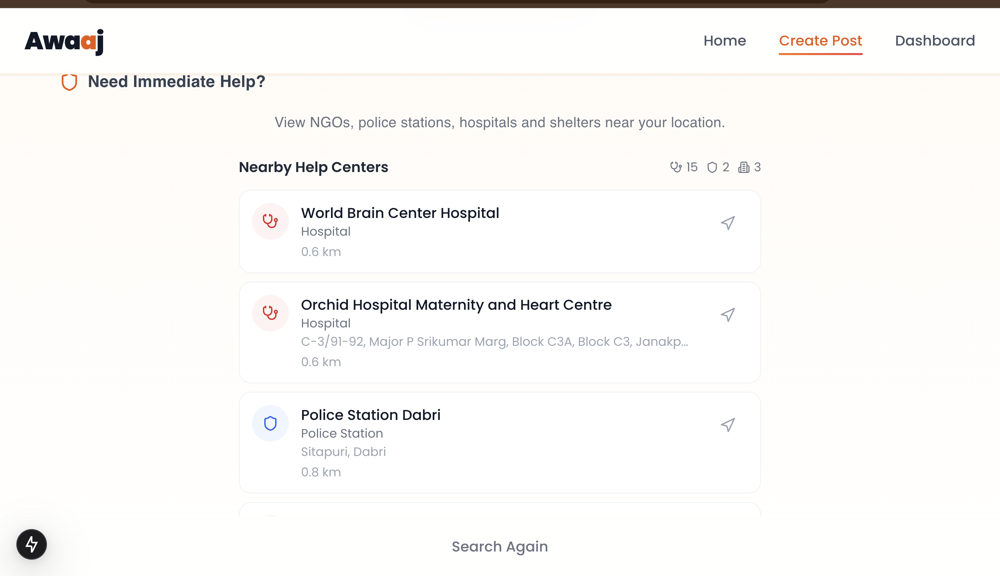</td>
  </tr>
  <tr>
    <td align="center" colspan="2"><b>Admin Login</b><br/>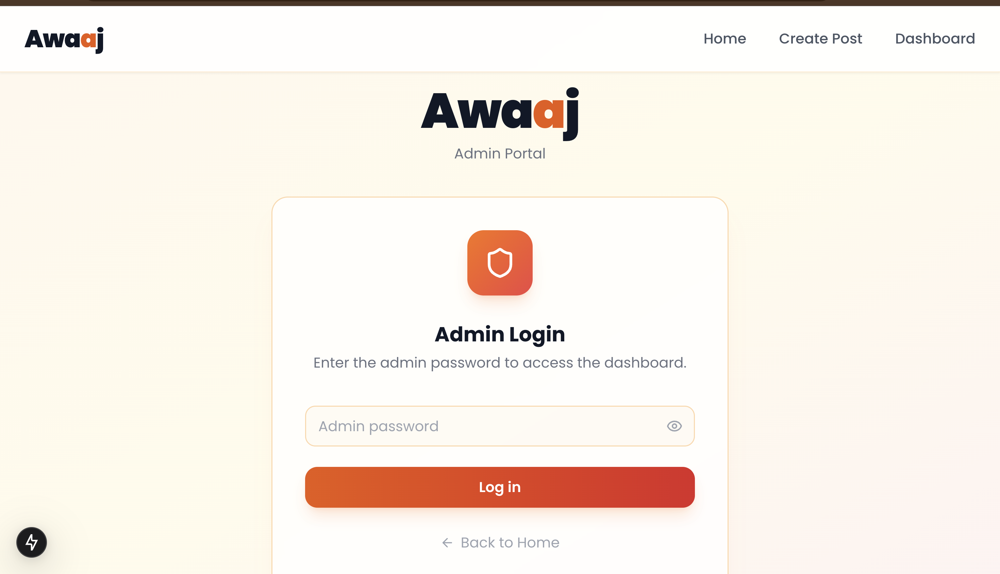</td>
  </tr>
</table>

---

## Why Awaaj is Different

Traditional reporting systems require victims to directly contact authorities, helplines, or organizations.

**Awaaj** introduces **covert reporting** through steganography.

Reports can be embedded inside ordinary images, allowing victims to preserve and share sensitive information without exposing it during normal viewing.

The platform combines:

- AI-assisted report generation
- Abuse classification
- Hidden report embedding
- Administrative case management
- Nearby support discovery

into a single workflow.

---

## Table of Contents

- [Demo](#demo)
- [Screenshots](#screenshots)
- [Why Awaaj is Different](#why-awaaj-is-different)
- [The Idea](#the-idea)
- [How It Works — Step by Step](#how-it-works--step-by-step)
- [Technical Explanation](#technical-explanation)
- [Future Improvements (Not Implemented)](#future-improvements-not-implemented)
- [Tech Stack](#tech-stack)
- [APIs Used](#apis-used)
- [Getting Started](#getting-started)
- [Environment Variables](#environment-variables)
- [License](#license)

---

## The Idea 

Awaaj is a safe space for people experiencing domestic abuse. Here's what the app does in simple terms:

1. **You fill out a form** — Tell us what's happening, where, and who is involved. Your location is auto-detected.
2. **AI writes a full report** — Our AI takes your answers and turns them into a detailed, first-person account.
3. **You pick a cover image** — Choose a harmless-looking image (like a sunset or "Good Morning" picture).
4. **Your report is hidden inside the image** — Using a technique called steganography, the report text is secretly embedded into the image pixels. The image still looks completely normal to anyone who sees it.
5. **The report is saved** — Admins can view the details and reach out to help you.
6. **Find nearby help (optional)** — If you feel unsafe, you can search for NGOs, police stations, hospitals, and shelters near your current location.
7. **Share on social media (future)** — In the future, you'll be able to post the image on Instagram or Facebook with a unique hashtag. Admin services can monitor registered Awaaj hashtags, retrieve associated images, and decode hidden reports.

**Privacy first**: The hidden information is not visible during normal viewing. Future versions will add encryption before embedding so that extracted payloads remain unreadable without authorization
---

## How It Works — Step by Step

```
        1. Fill Form ──► 2. AI Report + Image ──► 3. Hide in Image ──► 4. Saved ✓
                                      │                                      │
                                      │                                      ▼
                                      │                              5. Find Nearby NGOs
                                      │                                 (optional)
                                      │
                           [Future] Social Media
                           Post with #Hashtag
```

| Step | What Happens |
|------|-------------|
| **1. Fill Form** | User enters name, location (auto-detected), situation description, culprit details, duration, and frequency of abuse. |
| **2. AI Generation** | Form data is sent to Groq LLM which expands it into a detailed first-person report. Then the user enters an image prompt (or picks a suggestion) and 1 cover image is generated via Pollinations AI. |
| **3. Hide & Save** | User selects the image. The report text is embedded into the image using LSB steganography. The encoded image is saved to MongoDB GridFS. Post metadata (severity, classification, status) is saved to the database. |
| **4. Find Nearby Help** | On the completion screen, the user can click "Find Nearby NGOs & Safe Places" to see a list of NGOs, police stations, hospitals, and shelters within 5 km of their location. Each entry shows name, type, distance, phone number, and a button to open directions in Google Maps. |
| **5. Admin Review** | Admins log in at `/admin-login`, view all reports in a dashboard, see details including location on a map, and can close issues once resolved. |

---

## Technical Explanation

### Architecture

<div align="center">
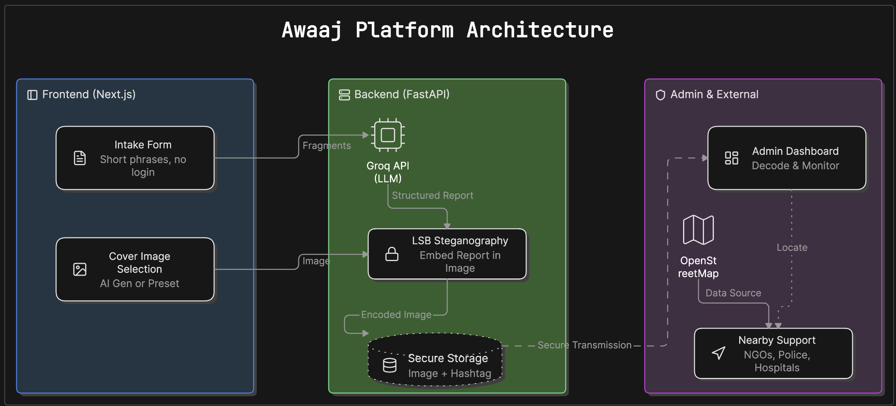
</div>

- **Frontend**: Next.js 15 (App Router) with TypeScript, Tailwind CSS, and shadcn/ui components. Runs on port 3000.
- **Backend**: FastAPI (Python) running on port 8000. Handles all business logic.
- **Database**: MongoDB with GridFS for image storage.
- **Communication**: Next.js API Route proxies (`/api/*`) forward requests to the FastAPI backend, avoiding CORS issues.

### Steganography (How Text is Hidden in Images)

The project uses **Least Significant Bit (LSB)** encoding via the Pillow library. Each pixel in an image has Red, Green, and Blue values (0–255). LSB steganography replaces the **last bit** of each color channel with one bit of the hidden message. Since only 1 bit out of 8 per channel is changed, the visual difference is imperceptible to the human eye.

```
Pixel before:  R=1101011[1]  G=1011001[0]  B=1110100[0]
Pixel after:   R=1101011[0]  G=1011001[0]  B=1110100[1]
                                        ^              ^
                        Only the last bit of each channel changes
```

### Nearby Places (Overpass API)

When the user clicks "Find Nearby NGOs & Safe Places", the frontend sends a query to the **Overpass API** (OpenStreetMap's free, no-key-required read API). The query searches for nodes tagged as `office=ngo`, `amenity=police`, `amenity=hospital`, `amenity=clinic`, and `amenity=social_facility` within a 5 km radius of the user's coordinates. Results are sorted by distance and displayed with type icons, phone numbers, and direct links to Google Maps navigation.

### Data Flow

```
User fills form
      │
      ▼
POST /api/generate-text ──► FastAPI ──► Groq LLM (expands text)
      │
      ▼
User enters image prompt
      │
      ▼
POST /api/generate-image ──► FastAPI ──► Pollinations AI (generates 3 images)
      │
      ▼
User selects image
      │
      ▼
POST /api/encode ──► FastAPI ──► Pillow LSB (hide text in image) ──► MongoDB GridFS
      │
      ▼
POST /api/classify-text ──► FastAPI ──► Groq LLM (extract severity/fields)
      │
      ▼
POST /api/save-post ──► FastAPI ──► MongoDB (save metadata)
      │
      ▼
User sees completion screen ──► Optional: Find Nearby Places via Overpass API
```

---

## Future Improvements (Not Implemented)

These features are planned for future versions but are **not yet built**:

### 1. Social Media Scraping with Hashtags

The idea is that after encoding, the user receives a unique hashtag (e.g., `#AwaajXXXXXXX`). When the user posts the image on Instagram or Facebook with this hashtag, an admin-side **web scraper** will:
- Periodically search social media platforms for posts containing active `#Awaaj*` hashtags.
- Download the image from the post.
- Decode the hidden text using the same steganography system.
- Match it to the database record and update the status (e.g., "Published on Instagram").

This would allow victims to report abuse without ever visiting the Awaaj website directly after the initial setup — the image posted on their social media acts as the anonymous report delivery mechanism.

### 2. Multi-Layer Protected Information

Currently, the text is hidden via steganography, which keeps it invisible. However, a future enhancement would add multiple layers of protection:

- **Encryption before embedding**: The report text would be AES-encrypted before being hidden in the image. Even if someone extracts the LSB data, they'd only see ciphertext.
- **Password-protected decoding**: Each image could require a unique decryption key that only the admin has.
- **Tamper detection**: A checksum or digital signature embedded alongside the data to detect if the image has been modified or re-compressed (which could destroy the hidden data).

This means that even if an attacker:
1. Knows that the image contains hidden data (steganography is visible to those who know what to look for), AND
2. Successfully extracts the raw bits from the LSB channels

They would **still** be unable to read the actual report without the encryption key.

---

## Tech Stack

### Frontend
| Layer | Technology |
|-------|-----------|
| Framework | Next.js 15 (App Router) |
| Language | TypeScript |
| Styling | Tailwind CSS + shadcn/ui components |
| Forms | react-hook-form + zod validation |
| Tables | @tanstack/react-table |
| UI Icons | lucide-react |
| Stepper | MUI (Material UI) Stepper |
| HTTP | axios |

### Backend
| Layer | Technology |
|-------|-----------|
| Framework | FastAPI (Python) |
| Runtime | uvicorn |
| Database | MongoDB (via pymongo) |
| File Storage | GridFS (for images) |
| Steganography | Pillow (LSB encoding/decoding) |
| LLM | Groq API (text generation & classification) |
| Image Gen | Pollinations AI (free, no API key) |

---

## APIs Used

| API | Purpose | Cost | Key Required |
|-----|---------|------|-------------|
| **Groq** | Expands form data into detailed report; classifies/structures report text
| **Pollinations AI** | Generates cover images from text prompts
| **Overpass API** (OpenStreetMap) | Queries nearby NGOs, police stations, hospitals, shelters 
| **OpenCage**  | Reverse geocodes coordinates to city name 
| **MongoDB Atlas** | Database and file storage 
---

## Getting Started

### Prerequisites
- Node.js 18+
- Python 3.10+
- MongoDB instance (local or Atlas)
- Groq API key (free at console.groq.com)

### 1. Clone & Install Backend

```bash
cd backend
python -m venv venv
source venv/bin/activate   # On Windows: venv\Scripts\activate
pip install -r requirements.txt
```

### 2. Configure Backend `.env`

```env
MONGO_ENDPOINT=mongodb+srv://<user>:<pass>@cluster.mongodb.net/?appName=<name>
GROQ_API_TOKEN=gsk_...your_groq_key...
```

### 3. Start Backend

```bash
uvicorn main:app --reload --port 8000
```

### 4. Install & Configure Frontend

```bash
cd frontend
npm install
```

### 5. Configure Frontend `.env.local`

```env
NEXT_PUBLIC_BACKEND_URL=http://localhost:8000
NEXT_PUBLIC_OPENCAGE_API_KEY=your_opencage_key_here  
ADMIN_PASSWORD=your_admin_password                    # Change this!
```

### 6. Start Frontend

```bash
npm run dev
```

Open **http://localhost:3000** in your browser.

---

## Environment Variables

### Backend (`backend/.env`)
| Variable | Required | Description |
|----------|----------|-------------|
| `MONGO_ENDPOINT` | ✅ | MongoDB connection string |
| `GROQ_API_TOKEN` | ✅ | Groq API key for LLM calls |

### Frontend (`frontend/.env.local`)
| Variable | Required | Description |
|----------|----------|-------------|
| `NEXT_PUBLIC_BACKEND_URL` | ✅ | URL of the running FastAPI backend |
| `ADMIN_PASSWORD` | ✅ | Password for admin dashboard login |
| `NEXT_PUBLIC_OPENCAGE_API_KEY` | ✅ | OpenCage Geocoding API key |

---

## License

MIT
